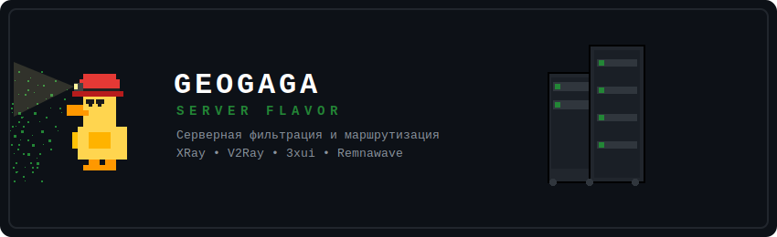

<table align="center">
  <tr>
    <td align="center">🔵 <a href="https://github.com/bratishkadrugoimamysynishka/geogaga-client-flavor">GeoGaga - Client Flavor</a></td>
    <td align="center">🟢 <a href="https://github.com/bratishkadrugoimamysynishka/geogaga-server-flavor"><b>GeoGaga - Server Flavor</b></a></td>
    <td align="center">🚀 Coming Soon..?</td>
  </tr>
</table>

<p align="center">
  
</p>

# GeoGaga — Server Flavor

**GeoGaga - Server Flavor** — это автоматически собираемые файлы данных `geoip.dat` и `geosite.dat`, специально оптимизированные для настройки умной **серверной** маршрутизации трафика. Сборка предназначена для использования непосредственно на стороне заграничного VPS-сервера под управлением Xray (в связке с панелями управления **3x-ui**, **Remnawave** и др.).

Главная особенность серверной версии — агрегация, очистка от дубликатов и перепаковка специфичных апстрим-категорий в кастомные группы правил с префиксом `geogaga`. Это позволяет эффективно отсекать мусорный трафик, экономить пропускную способность VPS, маскировать запросы к заблокированным хостингам, а также использовать классические правила для полноценной работы прокси-сервера.

---

## 🛠 Рекомендуемый порядок правил на сервере

Для достижения максимального быстродействия, экономии трафика VPS и правильной логики распределения ресурсов рекомендуется выстраивать правила маршрутизации на сервере в следующем порядке:

1. **Блокировка (`Block`)** ➡️ Реклама, телеметрия ОС, трекеры и тяжелый торрент-трафик. Соединение сбрасывается моментально (`blackhole`).
2. **Маскировка (`Proxy`)** ➡️ Ресурсы, требующие обхода или перенаправления (например, через Cloudflare WARP или другой вышестоящий апстрим).
3. **Напрямую (`Direct`)** ➡️ Финальное правило (По умолчанию). Весь остальной трафик идет без изменений через основной сетевой интерфейс сервера.

### Пример структуры в конфигурации Xray JSON:

```json
"routing": {
  "domainStrategy": "IPIfNonMatch",
  "rules": [
    {
      "type": "field",
      "outboundTag": "block",
      "domain": [
        "geosite:geogaga-block"
      ]
    },
    {
      "type": "field",
      "outboundTag": "block",
      "ip": [
        "geoip:geogaga-block"
      ]
    },
    {
      "type": "field",
      "outboundTag": "warp",
      "domain": [
        "geosite:geogaga-proxy"
      ]
    },
    {
      "type": "field",
      "outboundTag": "warp",
      "ip": [
        "geoip:geogaga-proxy"
      ]
    },
    {
      "type": "field",
      "outboundTag": "direct",
      "network": "tcp,udp"
    }
  ]
}
```

---

## 📦 Описание категорий GeoSite (`geosite.dat`)

Файл `geosite.dat` содержит доменные имена, распределенные по целевым группам, а также включает полную встроенную базу:

### 🚫 `geosite:geogaga-block`
Предназначена для жесткой фильтрации и блокировки ненужного трафика прямо на стороне VPS-сервера.
* **Включает в себя категории:**
  * Из репозитория *hydraponique/roscomvpn-geosite*:
    * `torrent`, `private`, `category-ads` — торрент-трекеры, приватные сети и рекламные домены.
  * Из репозитория *runetfreedom/russia-blocked-geosite*:
    * `category-ads-all`, `win-spy` — расширенная реклама и телеметрия Windows.

### 🔵 `geosite:geogaga-proxy`
Список доменов для маскировки и перенаправления (например, через Cloudflare WARP / сторонний прокси).
* **Включает в себя категории:**
  * Из репозитория *hydraponique/roscomvpn-geosite*:
    * `whitelist`, `category-ru` — списки доменов общего обхода.

### 🌐 Оригинальные теги
* Полная база доменов из репозитория **v2fly/domain-list-community**. Все категории (`google`, `netflix`, `github` и т.д.) импортируются без изменений для возможности создания классических правил маршрутизации.

---

## 🌐 Описание категорий GeoIP (`geoip.dat`)

Файл `geoip.dat` оперирует массивами IP-адресов и CIDR-подсетей.

### 🚫 `geoip:geogaga-block`
Сетевые диапазоны для моментального сброса пакетов на внешнем интерфейсе сервера.
* **Включает в себя категории:**
  * Из репозитория *hydraponique/roscomvpn-geoip*:
    * `private` — диапазоны частных адресов (RFC 1918) для сетевой фильтрации.

### 🔵 `geoip:geogaga-proxy`
Сетевые диапазоны, перенаправляемые в интерфейс маскировки трафика (Cloudflare WARP).
* **Включает в себя категории:**
  * Из репозитория *hydraponique/roscomvpn-geoip*:
    * `direct`, `whitelist` — доверенные IP-адреса и подсети для обработки через апстрим.

### 🌐 Оригинальные теги
* Полная база IP-адресов из репозитория **Loyalsoldier/v2ray-rules-dat**. Все категории (`ru`, `telegram` и т.д.) импортируются без изменений.

---

## 👥 Источники данных

Сборка компилируется благодаря автоматическому слиянию данных из следующих специализированных репозиториев:

| Репозиторий | Описание вклада в GeoGaga |
| :--- | :--- |
| [hydraponique/roscomvpn-geosite](https://github.com/hydraponique/roscomvpn-geosite) | Базовые списки обхода, реклама, торренты |
| [hydraponique/roscomvpn-geoip](https://github.com/hydraponique/roscomvpn-geoip) | Российские подсети, исключения, приватные IP |
| [runetfreedom/russia-blocked-geosite](https://github.com/runetfreedom/russia-blocked-geosite) | Расширенная реклама, телеметрия Windows |
| [v2fly/domain-list-community](https://github.com/v2fly/domain-list-community) | Полная база доменов v2fly (As-Is) |
| [Loyalsoldier/v2ray-rules-dat](https://github.com/Loyalsoldier/v2ray-rules-dat) | Полная база IP-адресов (As-Is) |

---

## 🔄 Автоматическое обновление

Сборка полностью автономна и обновляется один раз в сутки в **05:55 (GMT+3)** с помощью **GitHub Actions**.

В процессе работы автоматического сценария:
* Скрипт декомпилирует исходные `.dat` файлы, полностью очищает дубликаты и проверяет пересечения IP-диапазонов.
* Имена всех категорий внутри компилируемых бинарных файлов принудительно переводятся в верхний регистр (`UPPERCASE`) для обеспечения стопроцентной совместимости со всеми версиями серверных приложений и ядер.
* Финальный результат упаковывается в оптимизированный бинарный формат Protobuf.
